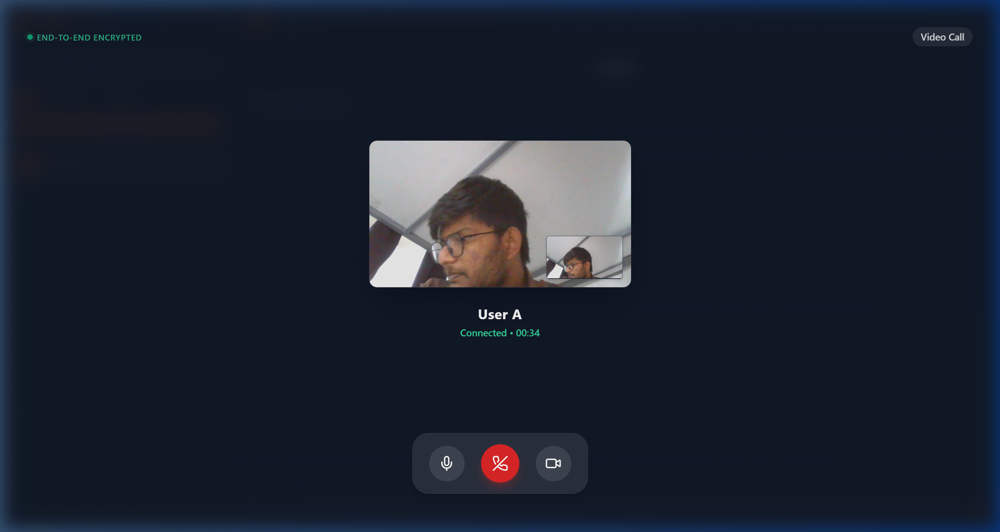

# Echo Connect – Real-Time Chat Application with Extensible Architecture

[](https://react.dev/)
[](https://nodejs.org/)
[](https://expressjs.com/)
[](https://www.mongodb.com/)
[](https://socket.io/)
[](https://webrtc.org/)
[](https://jwt.io/)
[](https://developers.google.com/identity)
[](https://vercel.com/)
[](https://railway.app/)

Echo Connect is a full-stack, responsive real-time chat application. It features a responsive React frontend supporting desktop and mobile layouts, and a secure, modular Node.js backend built following production-oriented practices.

---

## 🌐 Live Demo

* **Frontend App**: [https://echo-connect-8q3n.vercel.app/](https://echo-connect-8q3n.vercel.app/)
* **Backend API**: [https://echo-connect-production.up.railway.app](https://echo-connect-production.up.railway.app)
* **GitHub Repository**: [https://github.com/Nithinsai-tech/Echo-Connect-](https://github.com/Nithinsai-tech/Echo-Connect-)

---

## 🎥 Demo Walkthrough


---

## 🚀 Key Features

* **Real-Time Bidirectional WebSockets**: Instantaneous text messages, stickers, media attachments, and read status indicators driven by **Socket.IO**.
* **Designed with Redis Pub/Sub support for future horizontal scaling**: Syncs events across multiple clustered backend nodes.
* **Persistent Chat History**: Core message streams, participant arrays, and conversation logs are indexed and stored in **MongoDB Atlas**.
* **JWT Session Control**: JWT authentication with refresh token rotation using in-memory `accessToken` and cookie-less `refreshToken` storage with Axios authorization interceptors.
* **Google OAuth 2.0 Integration**: Passport-based Google authentication flow, automatically creating user profiles and linking them with local credentials.
* **One-to-One WebRTC Calling**:
  * Voice & Video Calls
  * Global Incoming Call Overlay
  * Picture-in-Picture Layout
  * ICE Reconnection
  * Echo Cancellation & Noise Suppression
  * Speaker & Mute Controls
* **Persistent Call History & Logs**: Tracks calling records, durations, timestamps, and statuses (Completed, Missed, Rejected) securely in the database, updating both participants instantly.
* **Message Controls**:
  * Message Star/Favorite logs (persisted locally)
  * Direct replies and forwards across rooms
  * Pinned messaging systems
  * Delete For Me (REST endpoint) and Delete For Everyone (real-time socket sync)
  * Sticker & Custom emoji picker
* **Cloudinary Media Streaming**: Stream-based uploads that bypass intermediate server disk writes, utilizing Multer memory buffers to directly push files to Cloudinary.
* **Personalization Engine**: Global context-driven client styling allowing real-time adjustment of:
  * Theme mode (Light / Dark)
  * Customized Accent Colors (Orange, Blue, Green, Purple, Pink)
  * Chat Bubble Styles & Background Wallpaper
  * Chat text sizing (Small, Medium, Large, Extra Large)
  * High Contrast Mode for accessibility

---

## ⚡ Performance

* **Socket.IO real-time messaging** with minimal payload structures.
* **WebRTC peer-to-peer media** stream routing to bypass backend servers.
* **MongoDB indexing** on user and message schemas for fast queries.
* **Cursor-based pagination** for smooth message history loading.
* **React lazy loading** and code splitting to reduce bundle size.
* **Optimized rendering** utilizing virtualized message lists to render hundreds of items efficiently.

---

## 🛡️ Security

* **JWT Authentication**: Short-lived access tokens combined with secure refresh rotation.
* **Google OAuth**: Delegated auth to prevent local storage of plain-text credentials.
* **Rate Limiting**: Express rate limiters on auth paths to protect against brute-force attacks.
* **Helmet**: Standard security headers activated on all HTTP requests.
* **Input Validation**: Server-side request sanitization and validation.
* **CORS Policies**: Strict origin controls allowing requests only from verified clients.
* **Protected Routes**: Client-side route guards synchronized with active session state.

---

## 📊 Features Checklist

| Feature | Status |
| :--- | :---: |
| JWT Authentication | ✅ |
| Google OAuth | ✅ |
| One-to-One Chat | ✅ |
| Group Chat | ✅ |
| Online Presence | ✅ |
| Typing Indicator | ✅ |
| Read Receipts | ✅ |
| Message Reactions | ✅ |
| Reply Messages | ✅ |
| Forward Messages | ✅ |
| Pin Messages | ✅ |
| Star Messages | ✅ |
| File Sharing | ✅ |
| Image Sharing | ✅ |
| Search Messages | ✅ |
| Notification Badges | ✅ |
| One-to-One Video Calling | ✅ |
| Global Call Portal Overlay | ✅ |
| Audio Output Speaker Routing | ✅ |
| ICE Connection Auto-Restart | ✅ |
| Call Logs & Offline Missed Calls | ✅ |
| Mobile Responsive | ✅ |
| Dark/Light Theme | ✅ |

---

## 📸 Screenshots

<details>
  <summary>💻 Desktop View</summary>
  <br/>
  
  ### Desktop Chat & Video Calling
  <table>
    <tr>
      <td><b>Desktop Chat Workspace (Dark Theme)</b></td>
      <td><b>One-to-One Video Calling</b></td>
    </tr>
    <tr>
      <td></td>
      <td></td>
    </tr>
  </table>
</details>

<details>
  <summary>📱 Mobile View</summary>
  <br/>

  ### Mobile Chat & Sidebar
  <table>
    <tr>
      <td><b>Mobile Conversations Sidebar</b></td>
      <td><b>Mobile Active Chat Window</b></td>
    </tr>
    <tr>
      <td></td>
      <td></td>
    </tr>
  </table>
</details>

---

## 🛠️ Tech Stack & Dependencies

* **Frontend**: React (Vite), TailwindCSS, custom HSL style system, Lucide Icons, Date-fns, React Window (list virtualization).
* **Backend**: Node.js, Express.js REST API.
* **Real-Time Layer**: Socket.IO client & server.
* **Database & Storage**: MongoDB (Mongoose ODM), Cloudinary.
* **Infrastructure**: Docker, Docker Compose, Redis (designed for scaling).

---

## 📦 System Architecture Diagram

```
                                 +--------------------------------+
                                 |     React Frontend Client      |
                                 +--------------------------------+
                                   /       |                      \
                     REST APIs   /        | Theme/Config          \ WebSockets & WebRTC
                                 v         v                        v
                   +-------------------+ +-------------------+  +------------------+
                   |  Express Servers  | |  LocalStorage &   |  | Socket.IO        |
                   +-------------------+ |  Visual State     |  | Real-Time Server |
                   | Passport Google,  | +-------------------+  +------------------+
                   | Rate Limiters     |                        | presence, DMs,   |
                   +-------------------+                        | read receipts    |
                             |                                  +------------------+
                             v                                           |
                   +-------------------+                        +------------------+
                   |  MongoDB / Atlas  |                        |  Redis Pub/Sub   |
                   | (Persistent logs) |                        |  Adapter Sync    |
                   +-------------------+                        +------------------+
                             |
                             v
                   +-------------------+
                   |  Cloudinary API   |
                   | (Media Storage)   |
                   +-------------------+
```

---

## 📂 Directory Map

```
/
├── backend/
│   ├── src/
│   │   ├── config/          # Database connection, Passport OAuth loaders
│   │   ├── controllers/     # Authentication, Room, and Message business logic
│   │   ├── middleware/      # JWT guards, Multer uploaders, Rate Limiters
│   │   ├── models/          # Persistent Schemas (User, ChatRoom, Message)
│   │   ├── routes/          # Express REST endpoint mappings
│   │   ├── services/        # Presence trackers, Cloudinary handlers
│   │   ├── socket/          # WebSocket event registrations (messaging, calling)
│   │   └── app.js           # Express app initialization
│   ├── uploads/             # Temp disk assets directory (if configured)
│   ├── Dockerfile
│   └── package.json
├── frontend/
│   ├── src/
│   │   ├── api/             # Axios client configuration & REST calls
│   │   ├── components/      # UI: Sidebar, ChatWindow, Modals, ProtectedRoute
│   │   ├── context/         # Auth, Chat, Socket, Theme, and Toast Contexts
│   │   ├── hooks/           # useAuth, useSocket, useChat hooks
│   │   ├── pages/           # Chat Workspace, Login, Register, AuthCallback
│   │   ├── utils/           # Time formatters, initials/avatar helper generators
│   │   └── App.jsx          # Router & Global Context wraps
│   ├── Dockerfile
│   └── package.json
├── docker-compose.yml       # Orchestrates multi-node backend, Redis & MongoDB
└── README.md
```

---

## ⚙️ Setup & Installation

### Option A: Local Run (Out of the Box)

#### 1. Setup Backend Node Server
Configure `backend/.env` using the fields from `backend/.env.example`:
```bash
cd backend
npm install
npm run dev
```
*Backend listener spins up on: `http://localhost:5000`*

#### 2. Setup React Web Client
Configure `frontend/.env` if custom API paths are required:
```bash
cd ../frontend
npm install
npm run dev
```
*Vite dev server launches on: `http://localhost:5173`*

---

### Option B: Docker Compose (Cluster Scaling Sandbox)

To test event synchronization locally using Redis:
1. Ensure **Docker Desktop** is open and running.
2. In the repository root directory, run:
   ```bash
   docker-compose up --build
   ```
3. Open your browser:
   * **Frontend Client UI**: `http://localhost:8080`
   * **Backend Node 1 Instance**: `http://localhost:5001`
   * **Backend Node 2 Instance**: `http://localhost:5002`

---

## ☁️ Deployment

* **Frontend Hosting**: Vercel
* **Backend Hosting**: Railway
* **Database**: MongoDB Atlas
* **Media & Storage**: Cloudinary

---

## 📡 API Reference

### 1. REST Endpoints

| Category | Method | Path | Description | Protected |
| :--- | :--- | :--- | :--- | :--- |
| **Auth** | `POST` | `/api/auth/register` | Register profile & get JWT tokens | No |
| **Auth** | `POST` | `/api/auth/login` | Validate user & get JWT tokens | No |
| **Auth** | `POST` | `/api/auth/refresh` | Rotate access and refresh tokens | No |
| **Auth** | `POST` | `/api/auth/logout` | Revoke tokens & clear session | No |
| **Auth** | `GET` | `/api/auth/google` | Trigger Google OAuth flow redirection | No |
| **Auth** | `GET` | `/api/auth/google/callback` | Google OAuth callback handler | No |
| **Users** | `GET` | `/api/users/me` | Retrieve active credentials profile | **Yes** |
| **Users** | `GET` | `/api/users` | List all registered users | **Yes** |
| **Rooms** | `POST` | `/api/rooms` | Create DM or Group Chat room | **Yes** |
| **Rooms** | `GET` | `/api/rooms` | Get recent conversations lists | **Yes** |
| **Messages**| `GET` | `/api/rooms/:roomId/messages`| Get chat history (Cursor Paginated) | **Yes** |
| **Messages**| `DELETE`| `/api/messages/:messageId`| Delete a message for active user | **Yes** |
| **Uploads** | `POST` | `/api/uploads` | Upload media attachment to Cloudinary | **Yes** |

### 2. Socket.IO Events

| Client-to-Server Event | Payload | Description |
| :--- | :--- | :--- |
| **`room:join`** | `{ roomId }` | Join specific room channel |
| **`room:leave`** | `{ roomId }` | Leave specific room channel |
| **`message:send`** | `{ roomId, content, type, mediaUrl }` | Dispatch message to a room |
| **`message:delivered`** | `{ messageId, roomId }` | Signal that a message has arrived |
| **`message:read`** | `{ roomId }` | Mark all unread messages as read |
| **`typing:start`** | `{ roomId }` | Broadcast user typing indicator |
| **`typing:stop`** | `{ roomId }` | Dismiss user typing indicator |
| **`call:initiate`** | `{ roomId, targetUserId, type, offer }` | Initialize WebRTC connection |
| **`call:answer`** | `{ callerId, answer }` | Answer incoming WebRTC call |
| **`call:reject`** | `{ callerId }` | Reject incoming WebRTC call |
| **`call:candidate`** | `{ targetUserId, candidate }` | Share ICE Candidate signaling |
| **`call:end`** | `{ targetUserId }` | Terminate active WebRTC session |
| **`call:toggle-video`** | `{ targetUserId, videoEnabled }` | Sync camera track state to remote participant |
| **`call:ice-restart`** | `{ targetUserId }` | Re-negotiate peer connection on network path drop |

---

## 🧪 Integration Testing & Verification

Echo Connect features an automated testing framework (`backend/test_suite.js`) to assert connection logic under load. To run the suite:
```bash
cd backend
npm install
node test_suite.js
```
The suite verifies REST APIs, JWT authentication, typing status indicators, message delivery receipts, read receipts, cursor-based pagination, and message deletions.

### 🎭 Playwright End-to-End Test Suite

A complete browser automation suite exists at `e2e/contact-friend-validation.mjs` to run real-world testing of:
* Profile registration & search filters.
* Live friend requests & badges.
* WebSocket real-time messaging delivery.
* Persistent database check after reload.
* Full WebRTC peer connection, media streaming, and call teardown.

To run the Playwright E2E suite locally:
```bash
node e2e/contact-friend-validation.mjs
```
